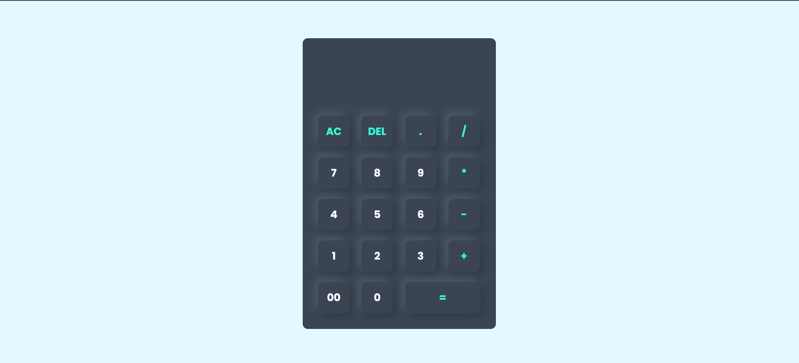

# Simple Calculator 🧮  

A basic calculator built using **HTML, CSS, and JavaScript**. This project allows users to perform simple arithmetic operations using an interactive UI with **JavaScript `onclick` methods**.  

## 🔹 Features  
✔️ Perform basic arithmetic operations (+, -, ×, ÷)  
✔️ Clear the input field  
✔️ Responsive design  
✔️ Simple and user-friendly UI  

## 📌 Technologies Used  
- **HTML**: Structure of the calculator  
- **CSS**: Styling and layout  
- **JavaScript**: Functionality using `onclick`  

## 🎥 Reference  
  
_Click the image to view the reference video!_  

## 📷 Screenshot  
   
